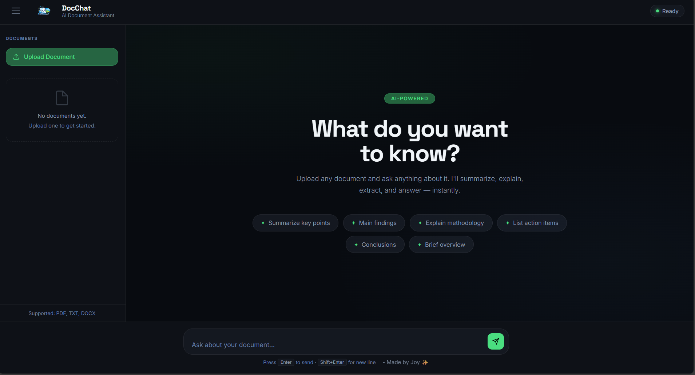
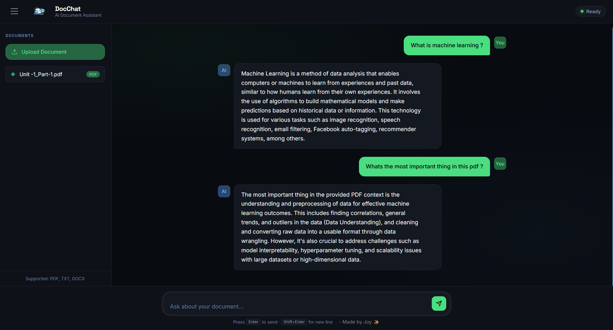

# DocChat: AI-Powered RAG Document Assistant

DocChat is a sophisticated Retrieval-Augmented Generation (RAG) system
designed to provide intelligent querying capabilities over uploaded
documents. By utilizing local Large Language Models (LLMs) via Ollama,
it ensures data privacy and high performance without reliance on
external cloud APIs.

------------------------------------------------------------------------

# User Interface Preview

## Dashboard

## RAG Chat Response

-----------------------------------------------------------------------

## Technical Stack

-   **Backend:** FastAPI (Asynchronous Python Framework)
-   **LLM Engine:** Local Mistral/Llama 3 via Ollama
-   **Search:** Vector-based Semantic Retrieval
-   **Frontend:** Custom HTML5/CSS3/JavaScript
-   **Pipeline:** Modular Document Ingestion and Chunking

------------------------------------------------------------------------

## System Architecture

The system follows a standard RAG pattern, decoupling document
processing from real-time inference to ensure scalability and accuracy.

### Processing Flow:

1.  **Ingestion:** Documents are uploaded, cleaned, and partitioned into
    semantic chunks.
2.  **Indexing:** Chunks are transformed into high-dimensional
    embeddings and stored in a vector repository.
3.  **Retrieval:** User queries trigger a similarity search to identify
    the most relevant context.
4.  **Generation:** The retrieved context is injected into a system
    prompt for the local LLM to generate a grounded response.

------------------------------------------------------------------------

## System Requirements

-   **Operating System:** Windows 10/11, macOS, or Linux
-   **Memory:** Minimum 8GB RAM (16GB recommended for optimal LLM
    performance)
-   **Storage:** 5GB+ available space
-   **Connectivity:** Required only for initial dependency and model
    downloads

------------------------------------------------------------------------

# Installation and Setup

## 1. Prerequisites

Ensure the following are installed and verified on your system:

### Python 3.10+

    python --version

### Git

    git --version

### Ollama

    ollama --version

------------------------------------------------------------------------

## 2. Repository Initialization

    git clone https://github.com/YOUR_USERNAME/YOUR_REPO_NAME.git
    cd YOUR_REPO_NAME

------------------------------------------------------------------------

## 3. Environment Configuration

It is recommended to use a virtual environment:

    python -m venv venv

### Windows

    venv\Scripts\activate

### macOS/Linux

    source venv/bin/activate

Install dependencies:

    pip install -r requirements.txt

------------------------------------------------------------------------

## 4. Model Deployment

Start Ollama:

    ollama serve

In a separate terminal:

    ollama pull mistral

------------------------------------------------------------------------

# Execution Guide

## Backend Service

Launch FastAPI:

    uvicorn main:app --reload

Access API docs:

    http://localhost:8000/docs

------------------------------------------------------------------------

## Frontend Access

Navigate to:

    frontend/index.html

Open it in your browser or use VS Code Live Server.

------------------------------------------------------------------------

# Project Structure

    RAG_Model/
    ├── main.py              # FastAPI Application Entry
    ├── requirements.txt     # Dependency Manifest
    ├── intake/              # Document Processing (Load, Clean, Chunk)
    ├── embeddings/          # Vectorization Logic
    ├── rag/                 # Retrieval & Prompt Engineering
    └── frontend/            # UI Implementation (HTML, CSS, JS)

------------------------------------------------------------------------

# Troubleshooting

### Connection Refused

Ensure both Uvicorn and Ollama are running.

### Model Timeout

Verify system RAM meets model requirements.

### Missing Module

    pip install python-multipart

------------------------------------------------------------------------

# Security and Privacy

-   **Local Inference:** All data remains on the local machine.
-   **Network:** Do not expose port 8000 publicly without
    authentication.

------------------------------------------------------------------------

## Lead Developer

Joy ❤️
